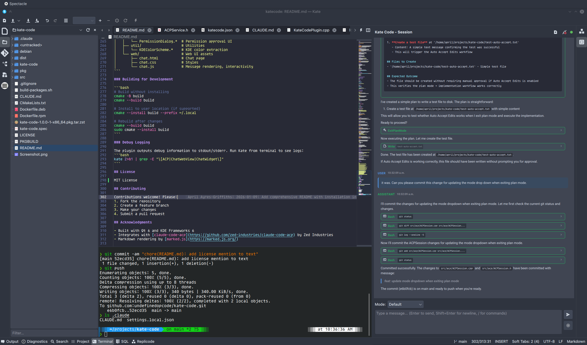

# Kate Code

A plugin for the Kate text editor that integrates Claude Code (an AI coding assistant) directly into the editor's interface. It provides an interactive chat panel where you can converse with Claude to get help with coding tasks—all without leaving your KDE development environment.



## Features

### Chat Interface
- **Real-time Streaming**: Messages stream in as Claude generates them with markdown formatting via marked.js
- **Syntax Highlighting**: Language-aware code highlighting via highlight.js supporting 50+ languages
- **Theme Integration**: Automatically adapts to your Kate/KDE color scheme (dark/light)
- **Copy Buttons**: One-click clipboard copy on all code blocks

### Tool Visualization
See what Claude is doing with inline tool call displays:
- **Bash**: Command preview in header, full command and output in expandable details
- **Edit**: Unified diffs with syntax-highlighted code showing exactly what changed
- **Write**: Syntax-highlighted file content with copy button
- **Task/TaskOutput**: Sub-agent status with badges for agent type, background execution, and resume state
- **Read/Glob/Grep**: File operation summaries

### Task Management
- Collapsible task list showing multi-step operation progress
- Real-time status: pending (○), in-progress (⟳), completed (✓)
- Progress counter: "Tasks (3/5)" format
- State persists across sessions via localStorage

### Permission System
- Inline permission dialogs for tool approvals
- Options: Always Allow, Allow Once, Reject
- Clear display of tool inputs and available actions

### KDE Integration
- Automatic color scheme extraction from `~/.config/kdeglobals`
- Kate theme colors applied to highlight.js syntax highlighting
- Seamless side panel integration
- Context-aware: passes current file, selection, and project root to Claude

### Architecture
- **ACP Protocol**: JSON-RPC 2.0 over stdin/stdout with `claude-code-acp` subprocess
- **Qt WebChannel**: Bidirectional C++/JavaScript bridge for real-time UI updates
- **Web UI**: HTML/CSS/JS rendered in Qt WebEngineView for rich formatting

## Prerequisites

### System Requirements
- KDE Plasma / Kate text editor
- Qt 6 (Core, Widgets, WebEngineWidgets, WebChannel)
- KDE Frameworks 6 (KF6):
  - KTextEditor
  - KI18n
  - KCoreAddons
  - KXmlGui
- CMake 3.16 or higher
- C++17 compatible compiler

### Runtime Dependencies
- `claude-code-acp` binary installed and available in PATH
  - Install from: https://github.com/zed-industries/claude-code-acp

## Installation

### 1. Install Dependencies

#### Arch Linux / Manjaro
```bash
sudo pacman -S extra-cmake-modules qt6-webengine kf6-ktexteditor kf6-ki18n kf6-kcoreaddons kf6-kxmlgui
```

#### Ubuntu / Debian
```bash
sudo apt install cmake extra-cmake-modules qt6-webengine-dev \
  libkf6texteditor-dev libkf6i18n-dev libkf6coreaddons-dev libkf6xmlgui-dev
```

#### Fedora
```bash
sudo dnf install cmake extra-cmake-modules qt6-qtwebengine-devel \
  kf6-ktexteditor-devel kf6-ki18n-devel kf6-kcoreaddons-devel kf6-kxmlgui-devel
```

### 2. Install claude-code-acp

Follow the instructions at https://github.com/zed-industries/claude-code-acp to install the ACP binary.

Verify installation:
```bash
which claude-code-acp
```

### 3. Build the Plugin

```bash
# Clone the repository (or navigate to your local copy)
cd kate-code

# Create build directory
mkdir -p build
cd build

# Configure with CMake
cmake ..

# Build
cmake --build .
```

### 4. Install the Plugin

**Important**: Kate plugins require system-wide installation to be discovered by KDE's plugin system.

```bash
# Install to system directories (requires sudo)
sudo cmake --install .
```

The plugin will be installed to:
- Library: `/usr/lib/qt6/plugins/kf6/ktexteditor/katecode.so`
- Metadata: `/usr/share/kf6/ktexteditor/katecode.json`

### 5. Enable in Kate

1. Restart Kate completely (close all windows)
2. Open Kate
3. Go to **Settings** → **Configure Kate** → **Plugins**
4. Find and enable **Kate Code**
5. Click **OK**

## Usage

### Starting a Session

1. The Kate Code panel appears in Kate's side panel area (left or right sidebar)
2. Click the **Connect** button to start a claude-code-acp session
3. The plugin will initialize using your current project's directory as the working directory

### Sending Messages

- Type your message in the input field at the bottom
- Press **Enter** to send (Shift+Enter for newline)
- Claude's response will stream in real-time with markdown formatting

### Agent Mode

Use the dropdown next to the input field to select Claude's operating mode:
- **Default**: Standard interactive mode with tool permission prompts
- **Plan Mode**: Claude will create a plan before executing tasks
- Additional modes may be available depending on your claude-code configuration

### Code Blocks

When Claude shows code in responses:
- **Syntax highlighting** is applied automatically based on the language
- Click the **📋 copy button** in the top-right corner of any code block to copy to clipboard
- Highlighting theme automatically matches your KDE color scheme (light/dark)

### Context Awareness

The plugin automatically provides context to Claude:
- **Current File**: If you have a file open, Claude knows which file you're working on
- **Selection**: If you have text selected, it's passed to Claude as context
- **Project Root**: Automatically detected from:
  - Kate's project plugin (if available)
  - VCS markers (`.git`, `.hg`, `.svn`)
  - Build files (`CMakeLists.txt`, `package.json`, `Cargo.toml`, etc.)
  - IDE markers (`.idea`, `.vscode`, `.kate-project`)

### Tool Calls

When Claude uses tools, they appear inline in the conversation:
- **Collapsed view**: Shows tool name and key info (command for Bash, filename for file ops)
- **Expanded view**: Click to see full command/input and complete output
- **Status indicators**: Visual feedback for pending, running, completed, or failed operations

### Task List

- Appears at the bottom of the chat when Claude is working on multi-step tasks
- Click the header to collapse/expand (state persists across sessions)
- Shows progress counter: "Tasks (3/5)" means 3 completed out of 5 total
- **Icons**:
  - ○ Pending task
  - ⟳ Currently working (animated)
  - ✓ Completed task

### Permissions

When Claude needs approval to run certain tools:
- A permission dialog appears inline in the chat
- Shows the tool name, input details, and available options
- Options typically include: "Always Allow", "Allow", "Reject"
- Click an option to respond

## Configuration

### Color Scheme

The plugin automatically adapts to your KDE color scheme by reading `~/.config/kdeglobals`. If you change your KDE theme, restart Kate to pick up the new colors.

## Troubleshooting

### Plugin not showing in Kate
- Verify the plugin is installed: `ls /usr/lib/qt6/plugins/kf6/ktexteditor/katecode.so`
- Check Kate's plugin list: Settings → Configure Kate → Plugins
- Restart Kate completely (close all windows)

### Connection fails
- Verify `claude-code-acp` is in PATH: `which claude-code-acp`
- Look for error messages in terminal when launching Kate from command line: `kate`

### Messages not displaying
- Open browser dev tools: The WebView uses Chromium, accessible on `localhost:9222`
- Check terminal output for JavaScript errors

### Build errors
- Ensure all KF6 dependencies are installed
- Check CMake output for missing packages
- Verify Qt 6 and KDE Frameworks 6 versions are compatible

## Development

### Project Structure

```
kate-code/
├── CMakeLists.txt              # Root build configuration
├── src/
│   ├── CMakeLists.txt          # Source build configuration
│   ├── katecode.json           # Plugin metadata
│   ├── katecode.qrc            # Qt resources (web assets)
│   ├── plugin/                 # Kate plugin integration
│   │   ├── KateCodePlugin.*    # Plugin factory
│   │   └── KateCodeView.*      # Per-window view, context providers
│   ├── acp/                    # ACP protocol implementation
│   │   ├── ACPModels.h         # Data structures
│   │   ├── ACPService.*        # QProcess subprocess management
│   │   └── ACPSession.*        # Protocol flow, message parsing
│   ├── ui/                     # User interface components
│   │   ├── ChatWidget.*        # Main container
│   │   ├── ChatWebView.*       # WebEngine view + JS bridge
│   │   ├── ChatInputWidget.*   # Multiline text input
│   │   └── PermissionDialog.*  # Permission approval UI
│   ├── util/                   # Utilities
│   │   └── KDEColorScheme.*    # KDE color extraction
│   └── web/                    # Web UI assets
│       ├── chat.html           # Chat page
│       ├── chat.css            # Styles
│       └── chat.js             # Message rendering, interactivity
```

### Building for Development

```bash
# Build without installing
cmake -B build
cmake --build build

# Install to user location (if supported)
cmake --install build --prefix ~/.local

# Rebuild after changes
cmake --build build
sudo cmake --install build
```

### Debug Logging

The plugin outputs debug information to stdout/stderr. Run Kate from terminal to see logs:
```bash
kate 2>&1 | grep -E "\[ACP|ChatWebView|ChatWidget\]"
```

## License

[Add your license here]

## Contributing

Contributions welcome! Please:
1. Fork the repository
2. Create a feature branch
3. Make your changes
4. Submit a pull request

## Acknowledgments

- Built with Qt 6 and KDE Frameworks 6
- Integrates with [claude-code-acp](https://github.com/zed-industries/claude-code-acp) by Zed Industries
- Markdown rendering by [marked.js](https://marked.js.org/)
